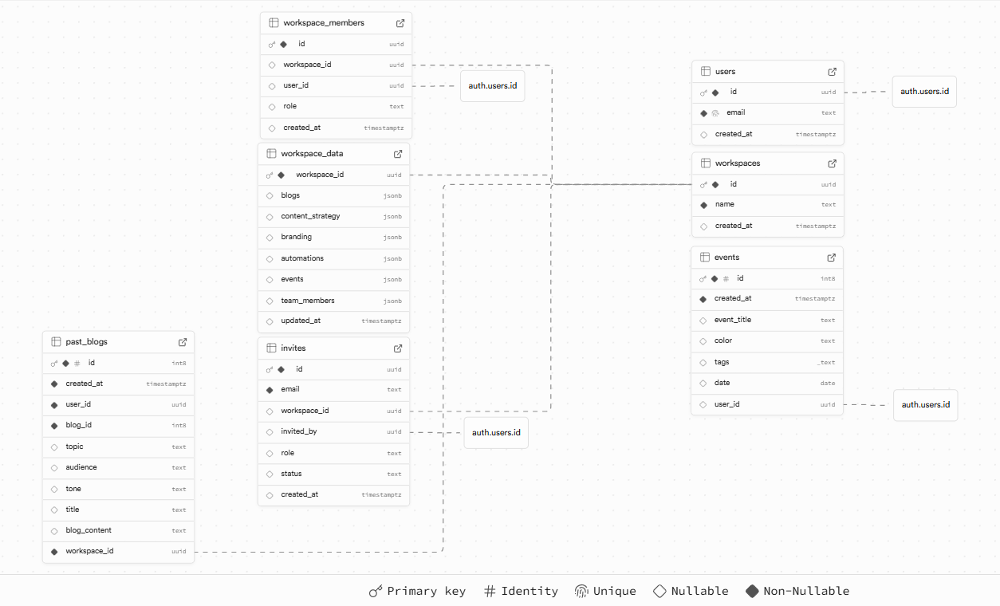

# BlogForge - AI SEO Content Engine

> _Note:_ This project was developed as a project for a course at UofT, partnering with High Ticket Closing Agency Inc. For security and confidentiality, the codebase is kept private. This repository serves as a presentation of the project for my portfolio.

---

## 📖 Project Overview

**BlogForge** is a no-code, web-based AI SEO content engine that automates the creation of high-quality, search-optimized blog posts. By removing the need for technical or SEO expertise, BlogForge enables day-one content creators to produce professional, search-friendly content with just a few clicks.

Designed for marketers, content creators, and small business owners, BlogForge dramatically reduces the time and cost of producing scalable content. Users can enter a topic or keyword and instantly generate SEO-ready blog posts, making it possible to start improving search rankings right away.

Built with React, TailwindCSS, Supabase, and n8n (utilizing SerpAPI and OpenAI), BlogForge combines a modern frontend with automated backend workflows to deliver a seamless and beginner-friendly content creation experience.

🌐 **Live App:** (Kept private)

---

## 🚀 Features & Functionality

### ✨Core Features

- **Keyword-Based Content Generation** – Enter a keyword or topic and instantly generate an SEO-ready blog post.

- **Customizable Tone & Target Audience** – Tailor content to match the voice and audience that best fit your brand.

- **Post Editing** – After generating a blog post, users can edit the content directly within the app before downloading or publishing.

- **JSON Output for Publishing** – Each post includes a downloadable JSON file that can be saved and published directly on a user’s website.

### 👤User Accounts & Workspaces

- **User Authentication** – Sign up and log in to securely manage your content.

- **Multiple Workspaces** – Manage different businesses or projects under a single account. Each workspace has its own memory and settings for complete separation of brand strategies.

### 📅Business Productivity Tools

- **Calendar Page** – Add events or schedule future blog posts.

- **Branding Page** – Fill out a content strategy intake form to generate blog posts tailored to your brand identity.

- **People Page** – Add collaborators to your workspace and assign them roles as Viewer, Editor, or Owner.

---

## ⚠️ Limitations (Current Stage)

- Only supports English-language content.

- Currently does not support image or media embedding in generated content.

---

## 📖 Usage Guide

Follow these steps to get started with BlogForge:

### 1️⃣ Sign Up and Log In

- Create an account and log in to access the platform.

- A default workspace is automatically created for you. Additional workspaces can be added anytime.

### 2️⃣ Set Up Your Brand Strategy

- Navigate to the Branding Page.

- Fill out the Content Strategy Intake Form to help BlogForge tailor blog posts to your brand’s identity.

### 3️⃣ Generate Your First Blog Post

- Return to the Dashboard.

- Enter a keyword or topic, choose a tone and target audience, and click Generate Post.

### 4️⃣ Edit and Download

- After the blog post is generated, you can edit it directly in the app.

- Once ready, download the blog post as JSON to publish it on your site.

---

## 👨‍💻 Developer Guide

### 📂Project Structure

- All application code is inside the application folder at the root of the repository. Developers can navigate between the frontend and backend directories as needed.

### 🛠️Tech Stack

- Frontend: React, TailwindCSS

- Backend: Supabase (database & auth), n8n (workflow automation)

- Deployment: Vercel

- Version Control: GitHub with feature-branch workflow

### 🔄GitHub Workflow

1. Work on feature branches named like feature/add-meta-tags or fix/image-api.

2. Pull requests go through code review and are merged into dev.

3. Code is then tested through continuous integration (GitHub Actions)

4. Peer approval is required before merging.

5. Merging to main triggers automatic deployment (via Vercel).

### 🌐API Endpoints

API calls (e.g., blog generation, workspace management) are handled entirely by **n8n workflows**.  
There are **no custom API routes in this codebase**. Any endpoint changes should be updated in n8n.

### 📊Architecture Diagram

### 🔄n8n Workflow Explanation

We have AI agents creating table of contents, parsing those tables and passing it onto another AI agent to research relevant information. Both agents utilize SerpAPI which enhances the Search Engine Optimization purpose of our project. Once information is researched, we have 2 more AI agents: one creates the actual blog post separating the table of contents and the content of each of the sections of the article, one generates a title which is an extremely important aspect of having an SEO-optimized blog to improve search rankings on Google. This entire workflow is no-code and fully automated.

The improvement made to our old workflow is attributed to prompt engineering, SerpAPI and OpenAI. Instead of having one agent do all the work, we have found that assigning smaller tasks to multiple AI agents works better which is why we have a BlogPost Expert, Content Planner, Research Team, Editor. Performance with this new structure of our workflow has increased exceptionally as we have more relevant information in the blog post and more usage of keywords that would improve our target user's search rankings on Google. Content is more structured and representative of the output coming from a human-team of editors and bloggers which is why our AI implementation has enhanced our application a lot.

Furthermore, we have user credentials stored in Supabase securely so that their organization and workspaces, along with their business goals can potentially be accessed by the n8n workflow in the future to customize and authenticize the outputted content. This Supabase connection is used in the workflow to store previous generations of blog posts if the user wishes to use more than one prompt.

### 🔄 Database Visualization

Our database is hosted on **Supabase** and designed to fully support **multi-workspace functionality** with granular role-based permissions.  

- **users**  
  Stores basic user information (ID, email, creation date) and maps to Supabase's `auth.users` table for authentication.  

- **workspaces**  
  Represents individual workspaces, each identified by a unique ID and associated metadata.  

- **workspace_members**  
  Links users to workspaces with defined roles (`owner`, `editor`, `viewer`), ensuring each user only has access to their assigned workspaces.  

- **workspace_data**  
  Holds core JSON-based data for a workspace including blogs, content strategy, branding, automations, events, and team members.  

- **invites**  
  Tracks workspace invitations sent to existing or new users, including the invited email, role, inviter, and invitation status.  

- **events**  
  Stores user-created events within workspaces, including titles, colors, tags, and scheduling information.  

- **past_blogs**  
  Keeps a record of previously generated or stored blog posts, linked to a specific **workspace** and **user**, with details such as topic, audience, tone, title, and content.  

This schema is optimized for:  
- **Data isolation** between workspaces  
- **Flexible JSON storage** for dynamic content  
- **Role-based access control** for secure collaboration  
- **Scalable invitations system** for onboarding team members  
- **Workspace-linked content history** for referencing or reusing past blog work  
---

## 🔨 Features in Progress / Extra Features to be Implemented

### ⚠️ **Features in Progress**

- Branding Page Intake Form – Frontend UI complete; pending integration to pass inputs as arguments to the AI research agent.

### ➕ **Extra Features to Add**

- Embedded Images – Support image generation or embedding within blog posts.

- Analytics Dashboard – Provide insights such as SEO scores with detailed breakdowns to help users understand their content’s performance.

- CMS Publishing Integration – Allow users to publish generated blog posts directly to their content management system.

- Multilingual Support – Expand the platform to generate blog posts in multiple languages.

- Onboarding Tutorial – Guide new users through the app with a simple, interactive walkthrough.

- FAQ Documentation – Add a dedicated FAQ page or section to address common user questions.

- ALT Text for Images – Allow users to add descriptive ALT text for images to improve accessibility and SEO.

- Meta Tags for Posts – Enable adding and editing of meta tags associated with each blog post for better SEO optimization.

---

## 🙌 Credits & Acknowledgments

### 👥 Team Members

| Name            | Role                                                               |
| --------------- | ------------------------------------------------------------------ |
| Abu Zahed       | Full-Stack Developer, Product Manager                              |
| Abuzar Ansari   | Full-Stack Developer, DevOps Manager                               |
| Barron Jiang    | Full-Stack Developer, Meeting Minutes Notetaker                    |
| Akshat Oza      | Back-end Developer, Development Manager                            |
| Kevin Umaiyalan | Back-end Developer                                                 |
| Yucan Miao      | Front-end Developer, UI/UX Designer                                |
| Kevin Lee       | Front-end Developer, UI/UX Designer, Scrum Master, Partner Liaison |

### 🤝 Partner Organization

We would like to thank **Marc Gaudett** from **High Ticket Closing Agency Inc.** for partnering with us on this project and providing guidance throughout the semester.

---

## 📄 License

We have chosen **not to apply a license** to this codebase, meaning default copyright laws apply.

This repository will remain **private between our team and the partner (Marc Gaudett)** and is **not open for redistribution or creating derivative works**.

This decision was made in accordance with our partner’s request to keep the code confidential.  
Only team members and individuals **explicitly approved by Marc Gaudett** will have access to develop or make changes to the codebase.

---
